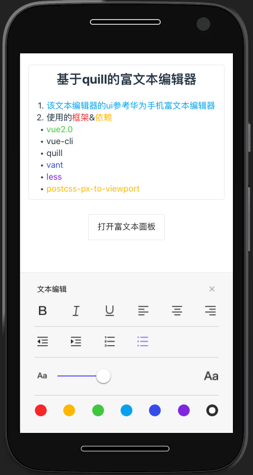

# 基于quill开发的手机富文本编辑器

+ 使用的框架&依赖
1. vue2.0
2. vue-cli
3. quill.js
4. vant-ui
5. less
6. postcss-px-to-viewport

* 引入quill资源

```html
<script src="https://cdn.quilljs.com/1.3.6/quill.js"></script>
<link href="https://cdn.quilljs.com/1.3.6/quill.snow.css" rel="stylesheet">
<!-- ps：为保持系统稳定，建议资源下载后使用 -->
```

* 使用示例

```html
 <edit-dom v-model="content"
            ref="editdom"
            @focus="handlefocus"
            @blur="handleBlur"
            @input="handleInput"
            placeholder="请输入" />
```
```js
this.$refs['editdom'].showToolbar() // 弹出富文本面板
this.$refs['editdom'].setHtmlContent('xxxxxx') // 设置文本内容
```

* 该文本编辑器的ui参考华为手机富文本编辑器



